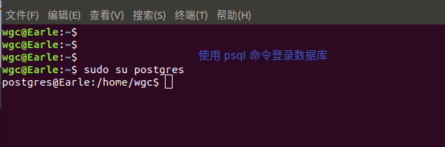
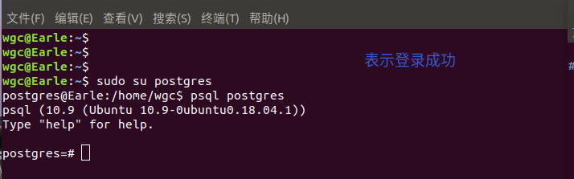
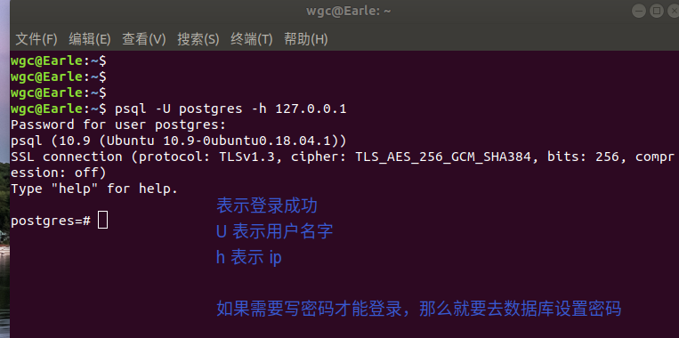
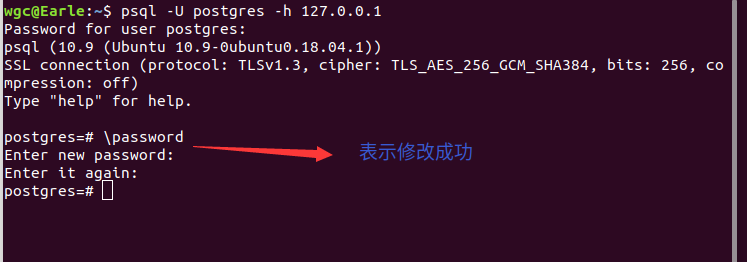

# Ubuntn PostgreSQL 安装指南

## 1、安装
	
	使用如下命令，会自动安装最新版本	

	sudo apt-get install postgresql postgresql-client
	
	安装完成后，默认会：   
	
	（1）创建名为"postgres"的Linux用户

	（2）创建名为"postgres"、不带密码的默认数据库账号作为数据库管理员

	（3）创建名为"postgres"的表

	 (4) 端口号： 5432

## 2、psql 命令
	
		\password：设置密码
		\q：退出
		\h：查看 sql 命令的解释，比如\h select
		\?：查看 psql 命令列表。
		\l：列出所有数据库。
		\c [database_name]：连接其他数据库。
		\d：列出当前数据库的所有表格。
		\d [table_name]：列出某一张表格的结构。
		\du：列出所有用户。
		\e：打开文本编辑器。
		\conninfo：列出当前数据库和连接的信息。

### 2.1 登录

		—U 指定用户
		—d 连接的数据库
		—h 要连接的主机
		—W 提示输入密码
		—p 端口号

#### 2.1.1、使用 Linux ** sudo su postgres ** 命令进入登录页面
	
		sudo su postgres

#### 2.1.2、使用 ** psql ** 命令直接进行登录

		psql -U postgres -h 127.0.0.1

### 2.2 修改密码

## 3、配置数据允许远程连接访问

	安装完成，默认情况下是不能进行远程连接的，要进行配置才能访问远程连接

	sudo vim /etc/postgresql/10/main/postgresql.conf
	
	将 
		# listen_addresses = 'localhost' 
	
	将注释去掉，并修改为
		
		listen_addresses = '*'

### 3.1 修改可以访问的用户IP

	sudo vim /etc/postgresql/10/main/pg_hba.conf

	在文件末尾添加上：

	host all all 0.0.0.0 0.0.0.0 md5	# 表示运行任务 IP 连接

### 3.2	重启服务

	sudo service postgresql restart
	
	sudo service postgresql start

	sudo service postgresql stop

## 4、创建用户和赋予权限

### 4.1 创建用户
	
	create user admin with password '123456';

### 4.2 赋予数据库权限

	-- 创建数据库并赋予用户	

	create database testdb owner admin;
	
	-- 只有登录权限， 没有操作权限, 登录的时候要指定数据库名字，否则无法登录
	
	grant all privileges on database testdb to admin;
 
	-- 创建一个数据库，并指定为超级用户

	sudo -upostgres createuser --superuser admin1;

	-- username  用户  test_table 赋予更新的权限
	
	grant update on test_table to username;

	-- 赋予 username 用户所有表的查询权限

	grant select on all tablename to in schema public to username;
	
	
	-- 赋予所有权限

	grant all on tablename to username;

	-- 将 select 权限赋予给所有用户

	grant select on tablename to public; 
	
	-- all 表示所有访问权限， public 表示所有用户
	

### 4.3 撤销用户的访问权限
	
	prvoke permission_type on tablename  from username;

	

