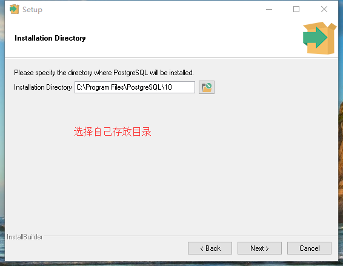
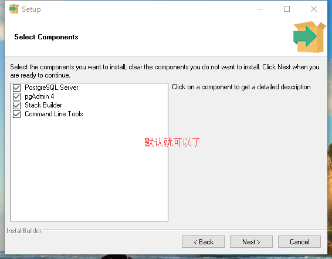
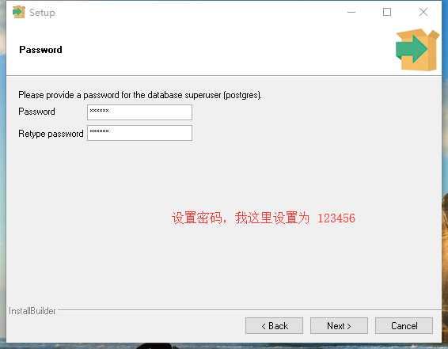
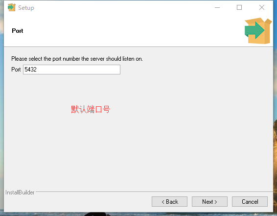

# Windown 10  PostgreSQL 安装指南

## 1、安装

	单击 postgresql-10.9-3-windows-x64.exe 软件进行安装

## 2、安装完成后打开 PostgreSQL 服务 

 2.1 要到 **../PostgreSQL/10/bin** 目录下打开

	单击打开：

		pg_ctl.exe

 2.2 打开 scripts 文件中 runpsql.bat 文件即可启动 PostgreSQL

 2.3 远程连接

